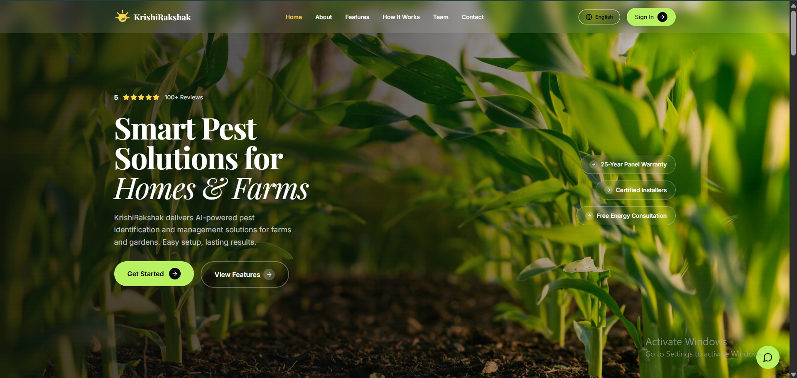
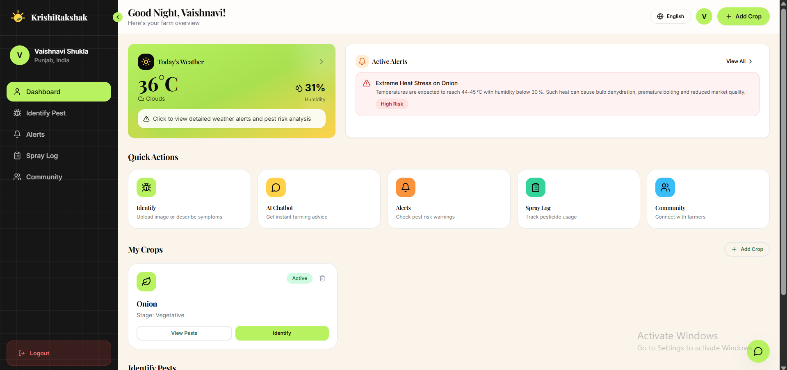
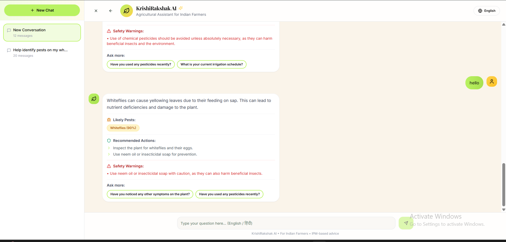
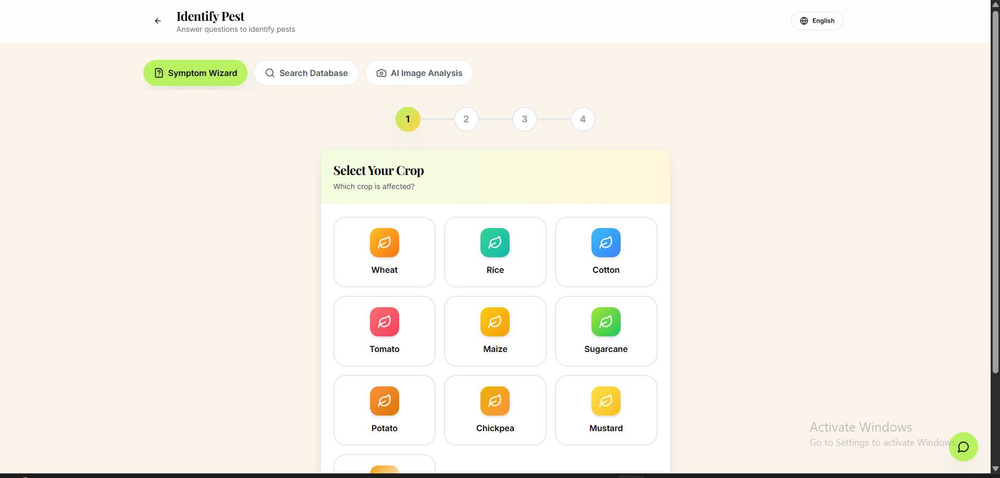
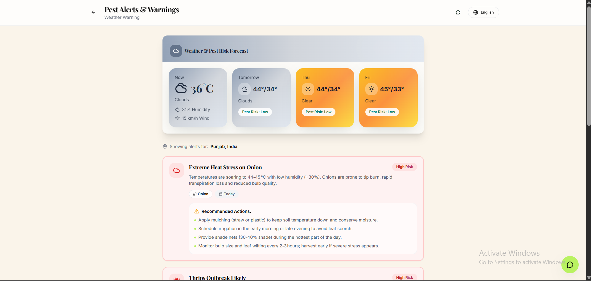
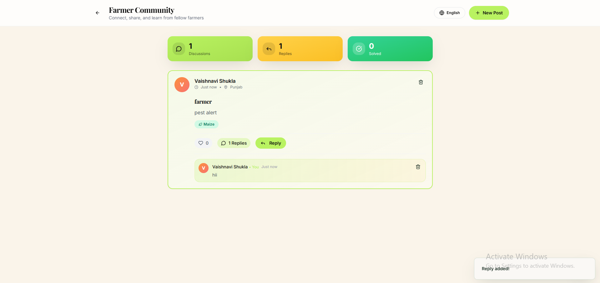
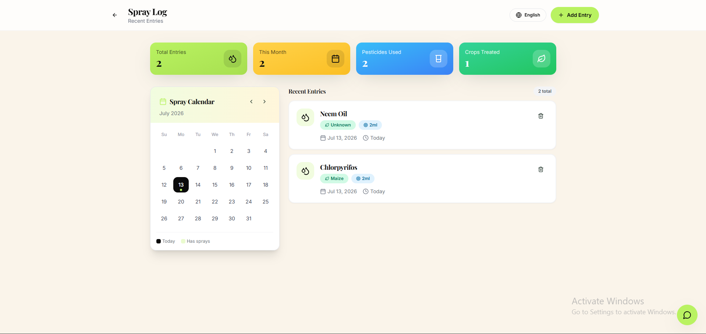

<div align="center">


# 🌱 KrishiRakshak

### AI-Powered Smart Pest Management Platform for Indian Farmers

[](https://krishi-rakshak.vercel.app)
[](https://krishi-rakshak-api.onrender.com)

---


<br />

**Intelligent crop protection through Artificial Intelligence — pest identification, weather intelligence, smart farming recommendations, crop management, and a vibrant farmer community built for Indian agriculture.**

[Live Demo](#-live-demo) · [Features](#-features) · [Tech Stack](#-tech-stack) · [Getting Started](#-getting-started) · [API Reference](#-api-reference) · [Deployment](#-deployment) · [Contributing](#-contributing)

</div>

---

## 🌐 Live Demo

| Service | URL | Platform |
|---------|-----|----------|
| **🖥 Frontend App** | [https://krishi-rakshak.vercel.app](https://krishi-rakshak.vercel.app) | Vercel |
| **⚙️ Backend API** | [https://krishi-rakshak-api.onrender.com](https://krishi-rakshak-api.onrender.com) | Render |

> [!NOTE]
> The backend is hosted on Render's free tier. The first request after a period of inactivity may take **30–50 seconds** to spin up (cold start). Subsequent requests will be fast.

---

## 📖 About

**KrishiRakshak** (कृषि रक्षक — *Crop Protector*) is a modern full-stack agriculture platform designed to help Indian farmers:

- 🔬 **Identify pests & diseases** instantly using AI-powered image analysis
- 🤖 **Get personalized farming advice** from an intelligent AI assistant
- 🌦️ **Monitor weather** and receive proactive crop-safety alerts
- 🌾 **Manage crops** and track pesticide spray schedules
- 👥 **Collaborate** with a community of fellow farmers

The platform combines **Computer Vision**, **Large Language Models (Groq/Llama)**, **Weather Analytics**, and **Community Collaboration** to deliver a comprehensive smart farming experience — with the goal of **reducing crop losses** and **empowering data-driven agricultural decisions**.

---

## ✨ Features

<table>
<tr>
<td width="50%">

### 🤖 AI Farming Assistant
- Groq-powered agricultural chatbot (Llama 3.1 8B)
- Context-aware, crop-specific conversations
- Personalized recommendations with conversation history
- Fast streaming responses

</td>
<td width="50%">

### 🔍 AI Pest Identification
- Upload crop images for instant analysis
- AI-powered pest & disease detection (Llama 4 Scout Vision)
- Detailed treatment recommendations
- Preventive measures & confidence scoring

</td>
</tr>
<tr>
<td>

### 🌦️ Smart Weather Dashboard
- Real-time weather conditions & 7-day forecast
- Temperature, humidity & wind monitoring
- Weather-based crop insights & farming advisories

</td>
<td>

### 🚨 AI Smart Alerts
- Pest outbreak predictions
- Disease risk alerts based on weather patterns
- Crop-specific AI-generated advisories
- Personalized notifications

</td>
</tr>
<tr>
<td>

### 🌾 Crop Management
- Add, monitor & manage active crops
- Personalized crop dashboard
- Growth tracking & health recommendations

</td>
<td>

### 🧪 Spray Log
- Maintain spray history & pesticide records
- Track application schedules
- Organized treatment logs

</td>
</tr>
<tr>
<td>

### 👥 Farmer Community
- Share farming experiences & ask questions
- Community discussions, comments & likes
- Collaborative knowledge sharing

</td>
<td>

### 🔐 Authentication & Security
- JWT-based authentication
- Secure login & registration
- Protected routes & profile management
- Rate limiting, helmet & input sanitization

</td>
</tr>
<tr>
<td colspan="2" align="center">

### 🌐 Multi-language Support
English & Hindi (हिंदी) — built with `i18next`

</td>
</tr>
</table>

---

## 📸 Screenshots

<details>
<summary><b>Click to view screenshots</b></summary>
<br />

| Page | Preview |
|------|---------|
| **Home** |  |
| **Dashboard** |  |
| **AI Chat Assistant** |  |
| **Pest Identification** |  |
| **Weather Dashboard** |  |
| **Community** |  |
| **Spray Log** |  |

</details>

---

## 🛠 Tech Stack

### Frontend

| Technology | Purpose |
|-----------|---------|
| **React 18** | UI library |
| **TypeScript** | Type-safe development |
| **Vite 8** | Build tool & dev server |
| **Tailwind CSS** | Utility-first styling |
| **shadcn/ui** | Accessible component library |
| **React Router v6** | Client-side routing |
| **TanStack React Query** | Server state management |
| **Framer Motion** | Animations & transitions |
| **Recharts** | Data visualization |
| **i18next** | Internationalization (EN/HI) |
| **Axios** | HTTP client |
| **Lucide Icons** | Icon library |

### Backend

| Technology | Purpose |
|-----------|---------|
| **Node.js 18+** | Runtime environment |
| **Express.js 4** | Web framework |
| **MongoDB Atlas** | Cloud database |
| **Mongoose** | ODM for MongoDB |
| **JWT** | Authentication tokens |
| **Multer** | File upload handling |
| **Cloudinary** | Cloud image storage |
| **Winston** | Logging |
| **Helmet / HPP** | Security headers & parameter protection |
| **Express Rate Limit** | API rate limiting |

### AI & External APIs

| Service | Model / API | Purpose |
|---------|-------------|---------|
| **Groq AI** | Llama 3.1 8B Instant | Chat assistant |
| **Groq AI** | Llama 4 Scout Vision | Image-based pest detection |
| **OpenWeatherMap** | Weather API | Real-time weather data |
| **Cloudinary** | Upload API | Image storage & CDN |

---

## 🏗 Architecture

```
┌─────────────────────────────────────────────────────────┐
│                      FARMER / USER                       │
└──────────────────────┬──────────────────────────────────┘
                       │  HTTPS
                       ▼
┌──────────────────────────────────────────────────────────┐
│              FRONTEND  (Vercel)                          │
│  React 18 · TypeScript · Vite · Tailwind · shadcn/ui    │
│  React Query · Framer Motion · i18next · Recharts       │
└──────────────────────┬──────────────────────────────────┘
                       │  REST API
                       ▼
┌──────────────────────────────────────────────────────────┐
│              BACKEND  (Render)                           │
│  Node.js · Express.js · JWT Auth · Rate Limiting        │
│  Helmet · Morgan · Winston · Express Validator          │
│                                                          │
│  ┌──────────┐  ┌──────────┐  ┌───────────────────────┐  │
│  │ Auth     │  │ AI       │  │ Crop / Community /    │  │
│  │ Routes   │  │ Routes   │  │ Alert / Spray Routes  │  │
│  └────┬─────┘  └────┬─────┘  └──────────┬────────────┘  │
│       │              │                    │               │
└───────┼──────────────┼────────────────────┼──────────────┘
        │              │                    │
        ▼              ▼                    ▼
   ┌─────────┐   ┌──────────┐       ┌─────────────┐
   │MongoDB  │   │ Groq AI  │       │OpenWeatherMap│
   │ Atlas   │   │ (Llama)  │       │     API      │
   └─────────┘   └──────────┘       └─────────────┘
                       │
                  ┌──────────┐
                  │Cloudinary│
                  │  (CDN)   │
                  └──────────┘
```

---

## 📁 Project Structure

```
KrishiRakshak/
│
├── public/                    # Static assets
│   ├── screenshots/           # App screenshots
│   ├── favicon.svg            # App icon
│   └── robots.txt             # SEO configuration
│
├── src/                       # Frontend source code
│   ├── assets/                # Images & static resources
│   ├── components/            # Reusable React components
│   ├── config/                # App configuration
│   ├── contexts/              # React context providers
│   ├── hooks/                 # Custom React hooks
│   ├── lib/                   # Utility libraries
│   ├── pages/                 # Route page components
│   │   ├── Index.tsx          #   Landing / Home page
│   │   ├── Dashboard.tsx      #   User dashboard
│   │   ├── Chat.tsx           #   AI chat assistant
│   │   ├── Identify.tsx       #   Pest identification
│   │   ├── Alerts.tsx         #   Weather & AI alerts
│   │   ├── Advisory.tsx       #   Farming advisories
│   │   ├── Community.tsx      #   Community forum
│   │   ├── SprayLog.tsx       #   Spray log manager
│   │   ├── Profile.tsx        #   User profile
│   │   ├── Contact.tsx        #   Contact page
│   │   ├── Login.tsx          #   Authentication
│   │   └── Register.tsx       #   Registration
│   ├── types/                 # TypeScript type definitions
│   ├── App.tsx                # Root app component
│   ├── App.css                # Global styles
│   └── main.tsx               # Entry point
│
├── server/                    # Backend source code
│   ├── config/                # DB & service configuration
│   ├── controllers/           # Route handlers
│   │   ├── aiController.js    #   AI chat & image analysis
│   │   ├── alertController.js #   Weather & AI alerts
│   │   ├── authController.js  #   Authentication logic
│   │   ├── chatController.js  #   Chat history management
│   │   ├── communityController.js  # Community posts
│   │   ├── cropController.js  #   Crop CRUD operations
│   │   ├── pestController.js  #   Pest database queries
│   │   ├── sprayLogController.js   # Spray log management
│   │   └── userController.js  #   User profile & crops
│   ├── middleware/            # Express middleware
│   │   ├── auth.js            #   JWT authentication
│   │   ├── rateLimiter.js     #   Rate limiting
│   │   └── security.js        #   Helmet & sanitization
│   ├── models/                # Mongoose schemas
│   ├── routes/                # API route definitions
│   ├── scripts/               # Database seed scripts
│   ├── services/              # Business logic services
│   ├── utils/                 # Helper utilities
│   ├── index.js               # Server entry point
│   └── package.json           # Backend dependencies
│
├── index.html                 # HTML entry point
├── vite.config.ts             # Vite configuration
├── tailwind.config.ts         # Tailwind CSS configuration
├── tsconfig.json              # TypeScript configuration
├── package.json               # Frontend dependencies
├── LICENSE                    # MIT License
└── README.md                  # This file
```

---

## 🚀 Getting Started

### Prerequisites

| Requirement | Version | Notes |
|------------|---------|-------|
| **Node.js** | 18+ | [Download](https://nodejs.org/) |
| **npm** | 9+ | Comes with Node.js |
| **MongoDB Atlas** | — | [Create free cluster](https://www.mongodb.com/atlas) |
| **Groq API Key** | — | [Get key](https://console.groq.com/) |
| **OpenWeatherMap API Key** | — | [Get key](https://openweathermap.org/api) |
| **Cloudinary Account** | — | [Sign up](https://cloudinary.com/) *(optional for image uploads)* |

### 1️⃣ Clone the Repository

```bash
git clone https://github.com/Vaishnavi1325/Krishi_Rakshak.git
cd Krishi_Rakshak
```

### 2️⃣ Install Dependencies

```bash
# Frontend dependencies
npm install

# Backend dependencies
cd server
npm install
cd ..
```

### 3️⃣ Configure Environment Variables

**Frontend** — create `.env` in the project root:

```env
VITE_API_URL=http://localhost:5000
```

**Backend** — create `server/.env`:

```env
# Server
PORT=5000
NODE_ENV=development
CLIENT_URL=http://localhost:5173

# Database
MONGODB_URI=mongodb+srv://<username>:<password>@<cluster>.mongodb.net/KrishiRakshak

# Authentication
JWT_SECRET=your_jwt_secret_key_here
JWT_EXPIRE=30d

# AI Service
GROQ_API_KEY=your_groq_api_key

# Weather
OPENWEATHERMAP_API_KEY=your_openweathermap_api_key

# Image Storage (Optional)
CLOUDINARY_CLOUD_NAME=your_cloud_name
CLOUDINARY_API_KEY=your_cloudinary_api_key
CLOUDINARY_API_SECRET=your_cloudinary_api_secret
```

### 4️⃣ Seed the Database

```bash
cd server
node scripts/seedPestDatabase.js
cd ..
```

### 5️⃣ Run the Application

Open **two terminal windows**:

```bash
# Terminal 1 — Backend (http://localhost:5000)
cd server
npm run dev

# Terminal 2 — Frontend (http://localhost:5173)
npm run dev
```

> [!TIP]
> The backend uses `nodemon` for hot-reloading during development. Any changes to server files will auto-restart the server.

---

## 📡 API Reference

Base URL: `https://krishi-rakshak-api.onrender.com` (production) or `http://localhost:5000` (local)

### 🔑 Authentication

All protected endpoints require the header:
```http
Authorization: Bearer <JWT_TOKEN>
```

| Method | Endpoint | Auth | Description |
|--------|----------|------|-------------|
| `POST` | `/api/auth/register` | ❌ | Register a new user |
| `POST` | `/api/auth/login` | ❌ | Login & receive JWT |
| `GET` | `/api/auth/me` | ✅ | Get current user profile |

### 🤖 AI Services

| Method | Endpoint | Auth | Description |
|--------|----------|------|-------------|
| `POST` | `/api/ai/chat` | ✅ | Chat with AI farming assistant |
| `POST` | `/api/ai/identify-image` | ✅ | Upload image for pest identification |

### 💬 Chat History

| Method | Endpoint | Auth | Description |
|--------|----------|------|-------------|
| `GET` | `/api/chat` | ✅ | Get chat conversations |
| `POST` | `/api/chat` | ✅ | Save chat message |
| `DELETE` | `/api/chat/:id` | ✅ | Delete a conversation |

### 🌾 Crop Management

| Method | Endpoint | Auth | Description |
|--------|----------|------|-------------|
| `GET` | `/api/crops` | ✅ | List all available crops |
| `GET` | `/api/user/crops` | ✅ | Get user's crops |
| `POST` | `/api/user/crops` | ✅ | Add a new crop |
| `PATCH` | `/api/user/crops/:id` | ✅ | Update crop details |
| `DELETE` | `/api/user/crops/:id` | ✅ | Remove a crop |

### 🌦️ Weather & Alerts

| Method | Endpoint | Auth | Description |
|--------|----------|------|-------------|
| `GET` | `/api/alerts` | ✅ | Get all alerts |
| `GET` | `/api/alerts/weather-forecast` | ✅ | 7-day weather forecast |
| `GET` | `/api/alerts/ai-alerts` | ✅ | AI-generated farming alerts |

### 👥 Community

| Method | Endpoint | Auth | Description |
|--------|----------|------|-------------|
| `GET` | `/api/community` | ✅ | Get community posts |
| `POST` | `/api/community` | ✅ | Create a post |
| `POST` | `/api/community/:id/comment` | ✅ | Comment on a post |
| `PATCH` | `/api/community/:id/like` | ✅ | Like / unlike a post |

### 🧪 Spray Logs

| Method | Endpoint | Auth | Description |
|--------|----------|------|-------------|
| `GET` | `/api/spray-logs` | ✅ | Get spray log history |
| `POST` | `/api/spray-logs` | ✅ | Add a spray log entry |
| `PATCH` | `/api/spray-logs/:id` | ✅ | Update a spray log |
| `DELETE` | `/api/spray-logs/:id` | ✅ | Delete a spray log |

---

## 🚀 Deployment

### Live Deployment Links

| Service | URL | Platform |
|---------|-----|----------|
| **Frontend** | [https://krishi-rakshak.vercel.app](https://krishi-rakshak.vercel.app) | Vercel |
| **Backend API** | [https://krishi-rakshak-api.onrender.com](https://krishi-rakshak-api.onrender.com) | Render |

---

### Deploy Frontend (Vercel)

1. Push your code to GitHub
2. Import the repository on [Vercel](https://vercel.com)
3. Configure the build settings:

| Setting | Value |
|---------|-------|
| **Framework Preset** | Vite |
| **Build Command** | `npm run build` |
| **Output Directory** | `dist` |

4. Add the environment variable:

```env
VITE_API_URL=https://krishi-rakshak-api.onrender.com
```

---

### Deploy Backend (Render)

1. Create a new **Web Service** on [Render](https://render.com)
2. Connect your GitHub repository
3. Configure the service:

| Setting | Value |
|---------|-------|
| **Root Directory** | `server` |
| **Build Command** | `npm install` |
| **Start Command** | `npm start` |
| **Runtime** | Node |

4. Add all required environment variables:

```env
PORT=5000
NODE_ENV=production
CLIENT_URL=https://krishi-rakshak.vercel.app
MONGODB_URI=your_mongodb_connection_string
JWT_SECRET=your_jwt_secret
JWT_EXPIRE=30d
GROQ_API_KEY=your_groq_api_key
OPENWEATHERMAP_API_KEY=your_openweathermap_api_key
CLOUDINARY_CLOUD_NAME=your_cloud_name
CLOUDINARY_API_KEY=your_cloudinary_api_key
CLOUDINARY_API_SECRET=your_cloudinary_api_secret
```

> [!IMPORTANT]
> Make sure to update `CLIENT_URL` on the backend to match your Vercel frontend URL, and `VITE_API_URL` on the frontend to match your Render backend URL. Mismatched URLs will cause CORS errors.

---

## 🎯 Project Objectives

- 📉 **Reduce crop losses** through early pest & disease detection
- 🎯 **Improve identification accuracy** with AI vision models
- ⚡ **Provide instant agricultural assistance** via AI chatbot
- 🌿 **Support sustainable farming** with data-driven recommendations
- 🤝 **Build a collaborative farmer community** for knowledge sharing
- 🌍 **Democratize agricultural technology** for Indian farmers

---

## 📈 Future Roadmap

| Priority | Feature | Status |
|----------|---------|--------|
| 🔴 High | Voice-enabled AI Assistant | Planned |
| 🔴 High | Push Notifications & SMS Alerts | Planned |
| 🟡 Medium | Offline / PWA Support | Planned |
| 🟡 Medium | Multi-language Expansion (Tamil, Telugu, Marathi) | Planned |
| 🟡 Medium | Soil Health Analysis Module | Planned |
| 🟢 Future | IoT Sensor Integration | Planned |
| 🟢 Future | Drone-based Crop Monitoring | Planned |
| 🟢 Future | Fertilizer Recommendation Engine | Planned |
| 🟢 Future | Farmer Marketplace | Planned |
| 🟢 Future | Government Scheme Integration | Planned |

---

## 🤝 Contributing

Contributions are welcome! Please follow these steps:

1. **Fork** the repository
2. **Create** a feature branch:
   ```bash
   git checkout -b feature/your-feature-name
   ```
3. **Commit** your changes using [Conventional Commits](https://www.conventionalcommits.org/):
   ```bash
   git commit -m "feat: add your feature description"
   ```
4. **Push** the branch:
   ```bash
   git push origin feature/your-feature-name
   ```
5. **Open** a Pull Request with a clear description

> [!TIP]
> Please check existing issues and pull requests before starting work to avoid duplicating effort.

---

## 🧪 Testing

```bash
# Run the frontend dev server
npm run dev

# Run the backend dev server
cd server && npm run dev
```

**Manual verification checklist:**

- [ ] User registration & login flow
- [ ] AI Chat — send messages & receive responses
- [ ] Pest Identification — upload image & get analysis
- [ ] Weather Dashboard — view current weather & forecast
- [ ] AI Alerts — check generated advisories
- [ ] Community — create post, like, comment
- [ ] Spray Log — add, edit, delete entries
- [ ] Crop Management — add & manage crops
- [ ] Profile — update user details

---

## 📄 License

This project is licensed under the **MIT License** — see the [LICENSE](LICENSE) file for details.

---

## 🙏 Acknowledgements

| Service / Tool | Usage |
|----------------|-------|
| [Groq AI](https://groq.com/) | LLM inference (Llama models) |
| [MongoDB Atlas](https://www.mongodb.com/atlas) | Cloud database |
| [OpenWeatherMap](https://openweathermap.org/) | Weather data API |
| [Cloudinary](https://cloudinary.com/) | Image storage & CDN |
| [React](https://react.dev/) | UI framework |
| [Vite](https://vite.dev/) | Build tooling |
| [Tailwind CSS](https://tailwindcss.com/) | Styling framework |
| [shadcn/ui](https://ui.shadcn.com/) | Component library |
| [Express.js](https://expressjs.com/) | Backend framework |
| [Framer Motion](https://www.framer.com/motion/) | Animations |

---

<div align="center">

### 🌱 KrishiRakshak

**Protecting Crops · Empowering Farmers · Smart Agriculture**

Built with ❤️ by [Vaishnavi](https://github.com/Vaishnavi1325)

<br />

<sub>If you found this project helpful, please consider giving it a ⭐ on GitHub!</sub>

</div>
